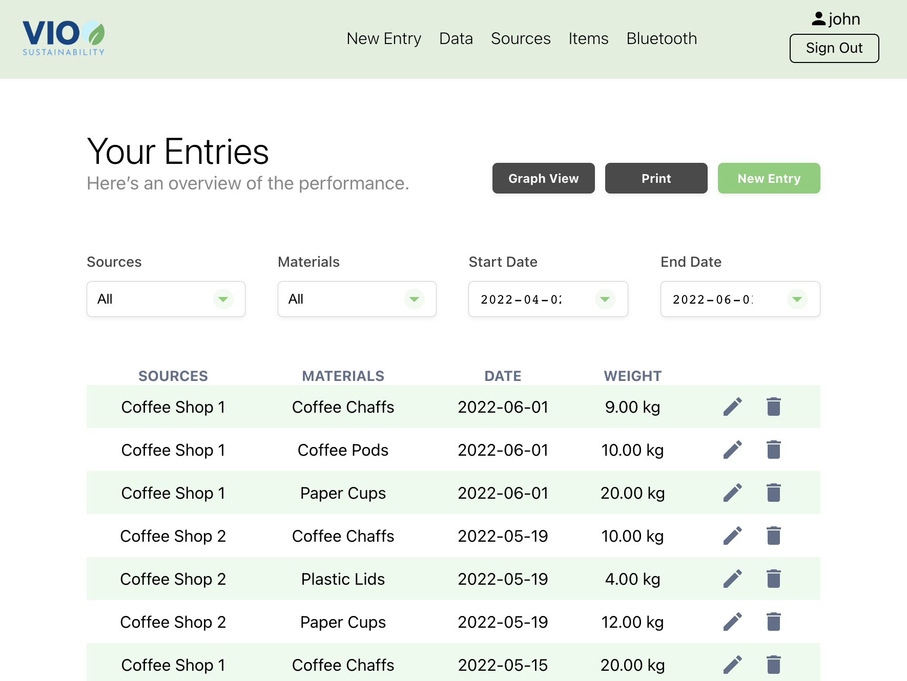
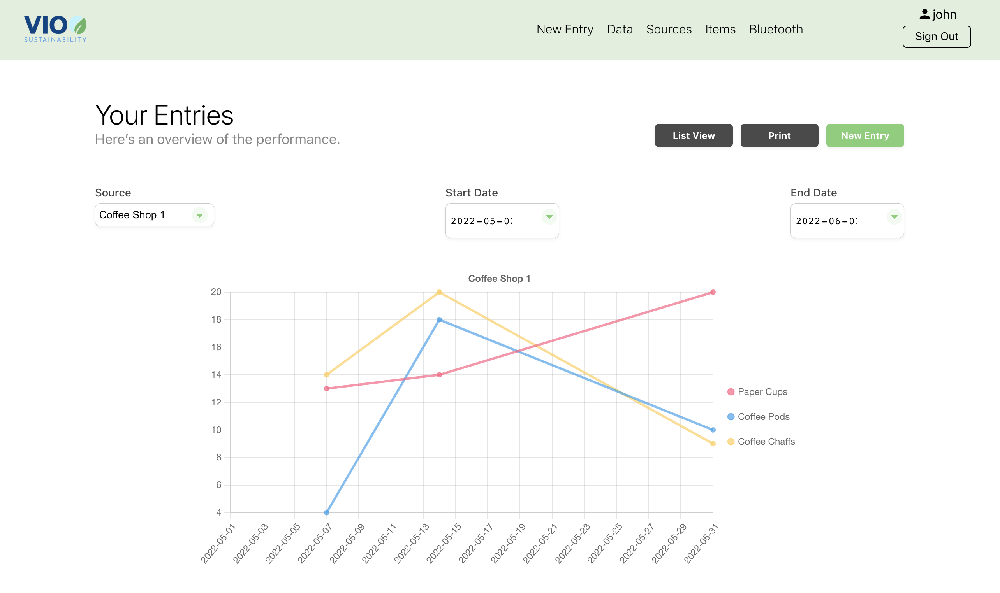

[![Contributors][contributors-shield]][contributors-url]
[![Forks][forks-shield]][forks-url]
[![Issues][issues-shield]][issues-url]

<!-- PROJECT LOGO -->
 

  <h2 align="center">Waste Collection App</h2>

  

    Waste Tracker Prototype for Vio Sustainability
     
    <!-- <a href="https://github.com/jojo-lam/collectiontrackerapp"><strong>Explore the docs </strong></a>
     
      -->
  

<blockquote>
<a href="https://collectiontrackerapp.herokuapp.com" target="_blank">View Demo</a>
 
To view the demo account login with the following credentials:
 
Email: john@recyco.com
 
Password: Gates123!</blockquote>
 

<!-- TABLE OF CONTENTS -->

  
Table of Contents

  <ol>
    <li>
      <a href="#about-the-project">About The Project</a>
      <ul>
        <li><a href="#built-with">Built With</a></li>
      </ul>
    </li>
    <li><a href="#usage">Usage</a></li>
    <li><a href="#roadmap">Roadmap</a></li>
    <li><a href="#contact">Contact</a></li>
  </ol>

<!-- ABOUT THE PROJECT -->
## About The Project

<!-- [![Product Name Screen Shot][product-screenshot]](https://example.com) -->

Vio Sustainability is creating a waste tracking and supply chain management analytics tool for businesses. Businesses using the service would be able to track their generated waste, communicate this information to a collector or end processor, and obtain analytics on amounts repurposed and diverted from landfills.

This project involves creating a dashboard that would allow clients to cater their company profile with materials of interest to track, have analytics generated through materials collected over time, and add visibility options to their own clients by allowing linking of accounts to see their associated analytics.

A team of 6 students from the Full Stack Web Development and the Digital Design and Development program from BCIT created the first prototype application.

(<a href="#top">back to top</a>)

### Built With

* [PostgreSQL](https://www.postgresql.org)
* [Express.js](https://expressjs.com)
* [React.js](https://reactjs.org/)
* [Node.js](https://nodejs.org/)
* [Chart.js](https://www.chartjs.org/)
* [Knex.js](https://knexjs.org)
* [Jest.js](https://jestjs.io)
* [Auth0](https://auth0.com)
* [Semantic UI](https://semantic-ui.com/)

(<a href="#top">back to top</a>)

<!-- USAGE EXAMPLES -->
## Usage

Users can collect items from different sources (i.e. other individuals, businesses, etc.) and track those items in graph or list form. Users would then be able to track how much of an item is coming from a source.

__*example*__ 
An individual collecting textiles from various donors in order to repurpose or sell the material could track where those materials are coming from and how often items come from a donor.

 

(<a href="#top">back to top</a>)

<!-- ROADMAP -->
## Roadmap

[View the roadmap on Miro](https://miro.com/app/board/uXjVO80JehE=/?share_link_id=714159911896)

- [x] [User Story Mapping](https://miro.com/app/board/uXjVOZXuSu0=/?share_link_id=803851791715)
- [x] Milestone 1: Add an entry and view, edit or delete previously added entries
    - [x] Database design
    - [x] Entry management
- [x] Milestone 2: Display added entries in for the user to analyze data
    - [x] Login & Registration with Auth0
    - [x] Source management
    - [x] Filters and total sums of entries
    - [x] Graphs
- [ ] Milestone 3: Allow data sharing between linked accounts
    - [ ] Link Sources to Accounts

<!-- CONTACT -->
## Contact

#### Developed By

Jo Jo Lam - [LinkedIn](https://www.linkedin.com/in/jojo-lam/) - [GitHub](https://github.com/jojo-lam) - cjojolam@gmail.com

Megan Kuo - [LinkedIn](https://www.linkedin.com/in/megankuo/) - [GitHub](https://github.com/megankuo) - megan.kuo@live.com

Sara Wasim - [LinkedIn](https://www.linkedin.com/in/sara-wasim/) - [GitHub](https://github.com/sarawasim) - sarawasim1@gmail.com

Octavio Villena - [LinkedIn](https://www.linkedin.com/in/octavio-villena/) - [GitHub](https://github.com/Ovillena) - octaviovillena.ov@gmail.com

<!-- Designers -->
#### Designed By
[Alicia Yien](https://www.linkedin.com/in/aliciayien/), [Jessica Wu](https://www.linkedin.com/in/jessicawu-/), and [Min Chun](https://www.linkedin.com/in/hoonminchun/)

(<a href="#top">back to top</a>)

<!-- MARKDOWN LINKS & IMAGES -->
<!-- https://www.markdownguide.org/basic-syntax/#reference-style-links -->
[contributors-shield]: https://img.shields.io/github/contributors/jojo-lam/collectiontrackerapp.svg?style=for-the-badge
[contributors-url]: https://github.com/jojo-lam/collectiontrackerapp/graphs/contributors
[forks-shield]: https://img.shields.io/github/forks/jojo-lam/collectiontrackerapp.svg?style=for-the-badge
[forks-url]: https://github.com/jojo-lam/collectiontrackerapp/network/members
[stars-shield]: https://img.shields.io/github/stars/jojo-lam/collectiontrackerapp.svg?style=for-the-badge
[stars-url]: https://github.com/jojo-lam/collectiontrackerapp/stargazers
[issues-shield]: https://img.shields.io/github/issues/jojo-lam/collectiontrackerapp.svg?style=for-the-badge
[issues-url]: https://github.com/jojo-lam/collectiontrackerapp/issues
[license-shield]: https://img.shields.io/github/license/jojo-lam/collectiontrackerapp.svg?style=for-the-badge
[license-url]: https://github.com/jojo-lam/collectiontrackerapp/blob/master/LICENSE.txt
[linkedin-shield]: https://img.shields.io/badge/-LinkedIn-black.svg?style=for-the-badge&logo=linkedin&colorB=555
[linkedin-url]: https://linkedin.com/in/othneildrew
[product-screenshot]: images/screenshot.png
